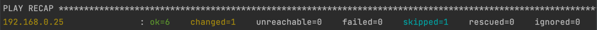

# FMC Ansible FTD HA Upgrade

The primary Ansible playbook performs a FTD image upgrade for a FTD HA pair managed in FMC. Bonus playbooks are included to demonstrate creating an access policy and deploying that policy to the newly upgraded HA Pair.

These playbooks use the `cisco.fmcansible` collection in Ansible galaxy. Please refer to the documentation [here](https://github.com/CiscoDevNet/FMCAnsible) for additional examples and explanation of the inner workings of the collection.

## Contacts
* Trevor Maco

## Solution Components
* FMC 7.2.2
* FTD 7.0.4 -> 7.2.2
* Ansible (2.14.1)

## Prerequisites

1. Ensure the FMC API is enabled using this [guide](https://www.cisco.com/c/en/us/td/docs/security/firepower/70/api/REST/firepower_management_center_rest_api_quick_start_guide_70/About_The_Firepower_Management_Center_REST_API.html)
   1. It's recommend to create a new FMC admin user for accessing the API's. Create a new user with the following [guide](https://www.cisco.com/c/en/us/td/docs/security/firepower/70/configuration/guide/fpmc-config-guide-v70/user_accounts_fmc.html#id_63961). 
2. Take note of the new user credentials and the FMC IP address for later.

## Installation/Configuration
1. Clone this repository with `git clone https://wwwin-github.cisco.com/gve/gve_devnet_fmc_ansible_ha_upgrade.git` and open the root directory.
2. Install Python 3 in your environment with the guide [here](https://www.python.org/downloads/). Once Python 3 is installed in your environment, you can create and activate a python virtual environment with the instructions found [here](https://docs.python.org/3/tutorial/venv.html).
3. Install the required Python libraries with the command:
   ``` bash
   pip3 install -r requirements.txt
   ```
4. Install the Ansible Galaxy collection with:
   ```bash
   ansible-galaxy collection install cisco.fmcansible
   ```
   **Note**:
   At the time of writing, a modification to the`_send_request` python method in the `client.py` internal file within the ansible collection is needed or the HA Upgrade playbook fails.
   
   * Possible File location: `/Users/<user>/.ansible/collections/ansible_collections/cisco/fmcansible/plugins/httpapi/client.py` (if not found, search for the `client.py` file)
   
   * Modify the `timeout` parameter to 100 as seen below (by default it is set at 10)
   
     


5. Modify the inventory file `inventory` and replace `fmc ip`, `username`, and `password` with the IP address, username, password collected from the prerequisites section. The file should look something like:
   ```bash
   [all:vars]
   ansible_network_os=cisco.fmcansible.fmc

   [all]
   10.0.0.1 ansible_user=admin ansible_password=admin ansible_httpapi_port=443 ansible_httpapi_use_ssl=True ansible_httpapi_validate_certs=True
   ```

## Usage

To run the ansible playbooks, execute the following command where `playbook.yml` is the desired playbook.

```bash
ansible-playbook -i inventory playbook.yml
```

### HA Upgrade
The primary playbook is the HA Upgrade playbook `ha_upgrade.yml` which follows the general workflow: 
* Image Distribution
* Readiness Checks
* Upgrading Firewall (Install on Passive Firewall, Failover, Install on Active Firewall)
* Post Checks

Example console output:




You can verify progress and results of the upgrade playbook in the FMC dashboard as well:

Initial Firewall Version:


Image Distribution:


Readiness Checks:


Upgrade in Progress:


Completed Upgrade:


### Access Policy

The access policy creation playbook is the `access_policy.yml` file which follows the general workflow: 

* Create an Access Policy Using the Balanced Intrusion Policy as the Default Rule
* Create and Apply a PERMIT Access Rule to the Access Policy Using a New Network Object as the Source Network
* Assign HA Pair to the New Access Policy

Example console output:


You can verify progress and results of the access policy playbook in the FMC dashboard as well:

Initial Policy Applied:


Initial Policy List:


Access Policy Created:


Access Policy Details:


Access Policy Applied (after running `deploy.yml` playbook):


### Deploy

The deployment playbook is the `deploy.yml` file which follows the general workflow: 

* Get Deployable Devices
* Fetch Pending Changes
* Deploy Changes


Example console output:


You can verify progress and results of the  playbook in the FMC dashboard as well:

Initial Deployment State: 


Deployment In Progress:


Successful Deployment:


# Screenshots


### LICENSE

Provided under Cisco Sample Code License, for details see [LICENSE](LICENSE.md)

### CODE_OF_CONDUCT

Our code of conduct is available [here](CODE_OF_CONDUCT.md)

### CONTRIBUTING

See our contributing guidelines [here](CONTRIBUTING.md)

#### DISCLAIMER:
<b>Please note:</b> This script is meant for demo purposes only. All tools/ scripts in this repo are released for use "AS IS" without any warranties of any kind, including, but not limited to their installation, use, or performance. Any use of these scripts and tools is at your own risk. There is no guarantee that they have been through thorough testing in a comparable environment and we are not responsible for any damage or data loss incurred with their use.
You are responsible for reviewing and testing any scripts you run thoroughly before use in any non-testing environment.